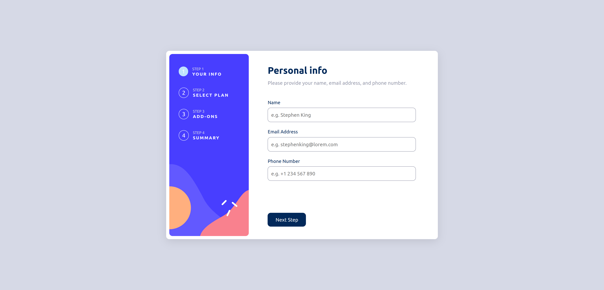
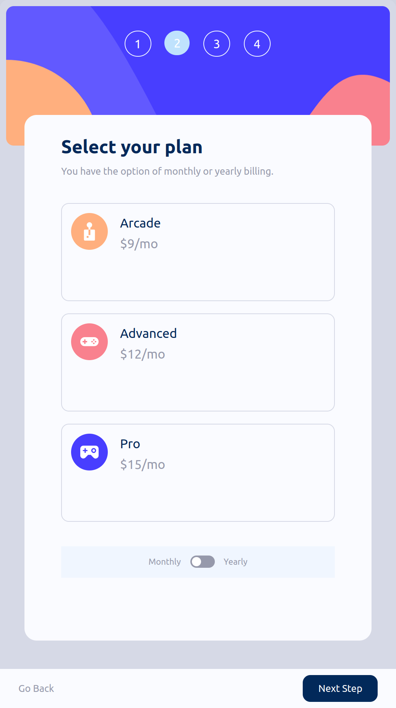

# Frontend Mentor - Multi-step form solution

This is a solution to the [Multi-step form challenge on Frontend Mentor](https://www.frontendmentor.io/challenges/multistep-form-YVAnSdqQBJ). Frontend Mentor challenges help you improve your coding skills by building realistic projects.

## Table of contents

- [Overview](#overview)
  - [The challenge](#the-challenge)
  - [Screenshot](#screenshot)
  - [Links](#links)
- [My process](#my-process)
  - [Built with](#built-with)
  - [What I learned](#what-i-learned)
  - [Continued development](#continued-development)
  - [Useful resources](#useful-resources)
- [Author](#author)

**Note: Delete this note and update the table of contents based on what sections you keep.**

## Overview

### The challenge

Users should be able to:

- Complete each step of the sequence
- Go back to a previous step to update their selections
- See a summary of their selections on the final step and confirm their order
- View the optimal layout for the interface depending on their device's screen size
- See hover and focus states for all interactive elements on the page
- Receive form validation messages if:
  - A field has been missed
  - The email address is not formatted correctly
  - A step is submitted, but no selection has been made

### Screenshot

### Links

- Solution URL: [Frontend Masters](https://your-solution-url.com)
- Live Site URL: [Live Site](https://your-live-site-url.com)

## My process

### Built with

- Semantic HTML5 markup
- CSS custom properties
- Flexbox
- CSS Grid
- Desktop-first workflow
- [React](https://reactjs.org/) - JS library
- Context Api for UI State Management
- [Styled Components](https://styled-components.com/) - For styles

### What I learned

I used styled-components for this project. Using props in styled-components sometimes get complex. This was my first time arranging a sites components based on mobile design using styled-components.

### Continued development

Mobile design can be improved. Email and phone errors can be added so we could let our users know that their email and phone numbers are not up to the standard.

### Useful resources

- [Styled Components Best Practices](https://www.robinwieruch.de/styled-components/) - I didn't fully read this article but used it make sure, I am using correct styled-components file structure and component design patterns.

## Author

- Frontend Mentor - [@yumelih](https://www.frontendmentor.io/profile/yumelih)
